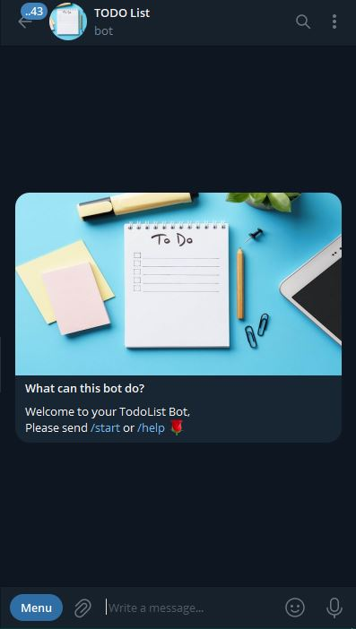
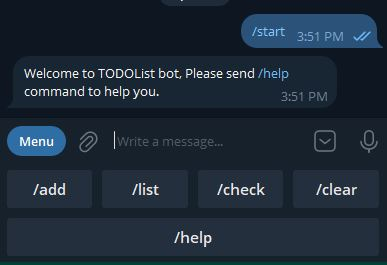
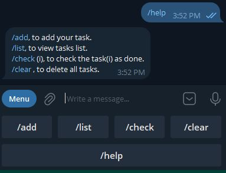

# TODO-List Bot with Python-telegram-bot

## Commands:
- <B>/start </B> (to start bot)
- <B>/help </B> (to got help)
- <B>/add </B> (to add a task)
- <B>/list </B> (to view tasks list)
- <B>/check </B> (to check task(i) as done)
- <B>/clear </B> (to clear all tasks)

 

 

 

 

 

 

 
